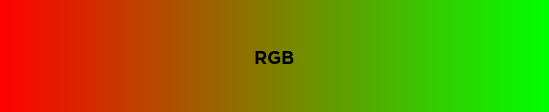
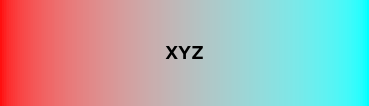
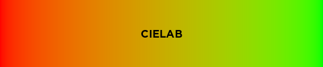

# Color

Color is a Roblox Luau library for color management and manipulation, inspired by [chroma.js](https://vis4.net/chromajs/).

## Installing

The module is available in the library [here](https://roblox.com/library/7933448750) if you want to install it using the Toolbox. You can also grab a [release](https://github.com/Blupo/Color/releases) from GitHub and install it manually.

If you know how to use [Rojo](https://rojo.space), you can build the latest code from the development branch to get the newest features. Keep in mind that this is **development code**, and things can break or change quickly.

## Conversions

Colors can be constructed from different [color types](api/color/#color-types), including hex strings, HSB/L, and L\*a\*b\*. You can use [`Color.from`](api/color/#colorfrom) or `Color.from[ColorType]` (e.g. `Color.fromHex`).

There are also a few additional constructors:

- [`Color.new`](api/color/#colornew), which is equivalent to `Color3.new`
- [`Color.random`](api/color/#colorrandom) for making random colors
- [`Color.gray`](api/color/#colorgray) for making greyscale colors
- [`Color.named`](api/color/#colornamed) for referencing [web colors](https://www.w3.org/TR/2021/REC-css-color-3-20210805/#svg-color)

```lua
local pink = Color.fromHex("#ff69b4")
local blue = Color.from("HSB", 240, 1, 1)
local yellow = Color.fromLab(0.97139, -0.21554, 0.94478)

local newYeller = Color.fromBrickColor(BrickColor.new("New Yeller"))
local white = Color.new(1, 1, 1) -- or Color.gray(1)

local hotpink = Color.named("hotpink")
```

Likewise, you can also convert Colors to various color types, using [`Color.to`](api/color/#colorto) or `Color.to[ColorType]` (e.g. `Color.toHex`). You can also get the RGB components of a color using [`Color.components`](api/color/#colorcomponents).

```lua
local blue = Color.new(0, 0, 1)

print(blue:toHex()) --> "0000ff"
print(blue:toHSB()) --> 240, 1, 1
print(blue:to("Lab")) --> 0.32297, 0.79188, -1.07860

print(blue:components()) --> 0, 0, 1
```

## Interpolation

Color interpolation in RGB (e.g. using `Color3.Lerp`) can result in grey or dark intermediate colors. This can be avoided by interpolating in a perceptually-uniform color space such as CIELAB or CIELUV, or by doing a "linear RGB" interpolation in XYZ. You can interpolate colors using [`Color.mix`](api/color/#colormix).

```lua
local red = Color.named("red")
local aqua = Color.named("aqua")

red:mix(aqua, 0.5)
red:mix(aqua, 0.5, "XYZ")
red:mix(aqua, 0.5, "Lab")
red:mix(aqua, 0.5, "Luv")
```

Here are images of what these interpolations look like:








## Miscellaneous

The library includes some general-purpose manipulation functions:

- [`Color.invert`](api/color/#colorinvert) for inverting colors
- [`Color.brighten`](api/color/#colorbrighten) and [`Color.darken`](api/color/#colordarken) for making colors brighter or darker
- [`Color.saturate`](api/color/#colorsaturate) and [`Color.desaturate`](api/color/#colordesaturate) for (de)saturating colors
- [`Color.blend`](api/color/#colorblend) for blending colors

It also includes some functions which can be used for accessibility:

- [`Color.luminance`](api/color/#colorluminance) for calculating the relative luminance of a color
- [`Color.contrast`](api/color/#colorcontrast) for calculating the contrast ratio between colors
- [`Color.bestContrastingColor`](api/color/#colorbestcontrastingcolor) for determining the color with the highest contrast ratio

There are also functions that don't fall into a general category:

- [`Color.deltaE`](api/color/#colordeltae) for calculating the difference between colors
- [`Color.harmonies`](api/color/#colorharmonies) for calculating harmonious colors

## Gradients

Gradients are similar in construction and behaviour to ColorSequences. They can be used to generate intermediate colors or ColorSequences so that they can be used in places where they're required, such as ParticleEmitters or UIGradients.

A Gradient can be constructed using an array of "gradient keypoints", which is just a dictionary with a `Time` and `Color` field, similar to the `Time` and `Value` fields of a [ColorSequenceKeypoint](https://developer.roblox.com/api-reference/datatype/ColorSequenceKeypoint). The constructor for this method is [`Color.gradient`](api/gradient/#colorgradient).

```lua
local keypoints = {
    {Time = 0, Color = Color.grey(0)},
    {Time = 0.25, Color = Color.grey(0.5)},
    {Time = 1, Color = Color.grey(1)}
}

local gradient = Color.gradient(keypoints)
```

You can also construct a Gradient with a list of Colors using [`Color.gradientFromColors`](api/gradient/#colorgradientfromcolors). This creates a gradient where the colors are equidistant from each other.

```lua
local gradient = Color.gradientFromColors(
    Color.named("red"),
    Color.named("green"),
    Color.named("blue")
)
```

Finally, the constructor [`Color.gradientFromColorSequence`](api/gradient/#colorgradientfromcolorsequence) creates a gradient from a ColorSequence.

```lua
local cs = ColorSequence.new(
    Color3.new(0, 0, 0),
    Color3.new(1, 1, 1)
)

local gradient = Color.gradientFromColorSequence(cs)
```

Generating colors from a gradient is similar to mixing colors, using [`Gradient.color`](api/gradient/#gradientcolor). If you need a list of colors, you can use [`Gradient.colors`](api/gradient/#gradientcolors). If you need a ColorSequence, you can use [`Gradient.colorSequence`](api/gradient/#gradientcolorsequence).

```lua
local gradient = Color.gradientFromColors(
    Color.named("red"),
    Color.named("green"),
    Color.named("blue")
)

print(gradient:color(0.6, "XYZ"):toHex()) --> "00737c"
print(gradient:color(0.6, "HSB", "Increasing"):to("Hex")) --> "00993d"

-- generates a list of 50 equidistant colors on the gradient
gradient:colors(50, "XYZ")

-- generates a ColorSequence using the maximum number of keypoints (currently 20)
gradient:colorSequence(nil, "XYZ")
```