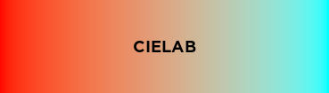

# Color

Color is a Roblox Luau library for color management and manipulation, inspired by [chroma.js](https://vis4.net/chromajs/). Some of its features include:

- Reading colors from many different formats
- Converting colors to many different formats
- Color interpolation in different spaces
- Creating gradients

## All the constructors

Colors can be constructed how you would construct a typical Color3.

```lua
local color = Color.new(1, 1, 1) -- or Color.from("RGB", 255, 255, 255)
```

Alternatively, you can construct them from different color types using [Color.from](api/color/#colorfrom). The list of available color types is available in the [Color Types](api/color/#color-types) section of the Color API reference.

```lua
local color3Equivalent = Color.from("Color3", Color3.new(1, 1, 1))
local brickColorEquivalent = Color.from("BrickColor", BrickColor.random())

local hexColor = Color.from("Hex", "6e05ff")
local hsvColor = Color.from("HSV", 120, 1, 1)
local hslColor = Color.from("HSL", 120, 1, 0.5)
local tempColor = Color.from("Temperature", 6500)

local randomColor = Color.random() -- we also have random colors
```

## All the conversions

Likewise, every color type can also be converted to, using [Color.to](api/color/#colorto).

```lua
local color = Color.from("Hex", "ff69b4")

color:to("BrickColor") --> BrickColor.new("Pink")
color:to("Color3") --> Color3.fromRGB(255, 105, 180)
color:to("HSV") --> 330, 0.58824, 1
color:to("HSL") --> 330, 1, 0.70588
color:to("Hex") --> ff69b4 (obviously)
color:to("Temperature") --> 4358
```

## Better interpolation

RGB interpolation (e.g. using [Color3.Lerp](https://developer.roblox.com/en-us/api-reference/datatype/Color3#functions)) can result in grey or dark intermediate colors. Using linear RGB, or interpolating in perceptually uniform color spaces such as [CIELAB](https://en.wikipedia.org/wiki/CIELAB_color_space) or [CIELUV](https://en.wikipedia.org/wiki/CIELUV) can help avoid these problems.




Interpolation can be done using [Color.mix](api/color/#colormix).

```lua
local red = Color.new(1, 0, 0)
local green = Color.new(0, 1, 0)

red:mix(green, 0.5)
red:mix(green, 0.5, "lRGB")
red:mix(green, 0.5, "Lab")
```

## Gradients

Gradients are lists of Colors that can be used for generating [ColorSequences](https://developer.roblox.com/api-reference/datatype/ColorSequence) or intermediate Colors, and are themselves similar to ColorSequences. You can read the Gradient API reference [here](api/gradient/).

```lua
local color1 = Color.from("Hex", "4cbbfc")
local color2 = Color.from("Hex", "47af22")
local color3 = Color.from("Hex", "0000ff")
local gradient = Color.gradientFromColors(color1, color2, color3)

local aColor = gradient:color(0.5, "lRGB")
local manyColors = gradient:colors(10, "lRGB")

local cs = gradient:toColorSequence(20, "lRGB")
```

## Installing

The module is available in the library [here](https://roblox.com/library/7933448750) if you want to install it using the Toolbox. You can also grab a [release](https://github.com/Blupo/Color/releases) from GitHub and install it manually.

If you know how to use [Rojo](https://rojo.space), you can build the latest code from the development branch to get the newest features. Keep in mind that this is **development code**, and things can break or change quickly.